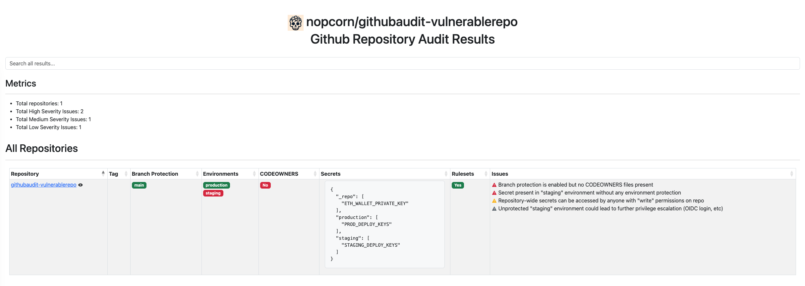

# githubaudit  :flying_saucer:

`githubaudit` is a powerful Python-based utility designed to perform comprehensive audits of GitHub organizations, users, or specific repositories. It provides insights into repository configurations, security settings, and potential vulnerabilities across your GitHub assets. 

Initially written as an offensive security tool to identify repositories within an organization to focus on for CI/CD pipeline exploitation, it has been expanded to offer value to the defensive side as an audit tool.

## Features

- **Flexible Targeting**: Audit entire organizations, individual users, or specific repositories.
- **Comprehensive Checks**: Analyzes branch protection, environments, CODEOWNERS files, secrets, and more.
- **Issue Detection**: Automatically identifies and categorizes potential security issues (see Issues section below).
- **Multiple Output Formats**: Generate results in HTML for easy viewing or JSON for further processing.
- **Rate Limit Handling**: Built-in mechanisms to handle GitHub API rate limits.

Current limitations:
- Limited support for rulesets. 

## Requirements

- A Github PAT with the `repo` scope

## Installation

To install `githubaudit` globally, simply `pip install githubaudit`.

Installing within a virtual environment is recommended.

## Usage

```
usage: githubaudit [-h] -a AUTH -t TARGET [-o {html,json}] [-v]

GitHub Organization/User/Repository Audit Script

options:
  -h, --help                             show this help message and exit
  -a AUTH, --auth AUTH                   GitHub API token
  -t TARGET, --target TARGET             Target in format: org, user, org/repo, or user/repo
  -o {html,json}, --output {html,json}   Output format (default: html)
  -v, --verbose                          Enable verbose output
```

## Examples

#### Assess all repositories for organization `github-internal` and generate an html report

```shell
$ githubaudit --auth ghp_xxxxxxxxxxxxxxxxxxxx --target github-internal --output html
$ file github-internal_DATE_TIMESTAMP.html
```

#### Assess a specific repository called `windows-source` owned by user `bill-gates` and generate an html report

```shell
$ githubaudit --auth ghp_xxxxxxxxxxxxxxxxxxxx --target bill-gates/windows-source --output html
$ file bill-gates_windows-source_DATE_TIMESTAMP.html
```

#### Get issues from the organization `nso-group` in json format for further command line processing

```shell
$ githubaudit --auth ghp_xxxxxxxxxxxxxxxxxxxx --target nso-group --output json
{
  "ios-exploits-internal-repo": [
    {
      "level": "medium",
      "message": "Repository-wide secrets can be accessed by anyone with \"write\" permissions on repo"
    }
  ]
}
```

### HTML Output

This is a render for a single repository. If run against an organization, you'll see all repositories in the table and will be able to search/filter through them.



## Issues

This tool will perform some basic checks to see if there are any issues that should be looked at. Currently supported issues are:

- **Branch protection is enabled but no CODEOWNERS files present**. Branch protection has been enabled on the repository, but no CODEOWNERS files have been found. This could mean that anyone could approve a pull request and merge into the protected branch. This is dependent on the specifics of the branch protection, but it's an issue worth investigating.
- **CODEOWNERS files present but no branch protection configured**. There is a CODEOWNERS file, but branch protection isn't configured. This could indicate that the admins of the repo intended to have an approval process, but neglected to finish the configuration and set up branch protection.
- **Errors in CODEOWNERS file(s)**. There are errors with the CODEOWNERS file. 
- **Repository-wide secrets can be accessed by anyone with "write" permissions on repo**. There are secrets in the root environment of the repository, meaning anyone who can write to the repository can push a branch and leak those secrets.
- **Secret present in "env_name" environment without any environment protection**. Similar to the issue above. There are secrets in an environment, but the environment has no protections. Anyone with write access to the repository can push a branch and a malicious workflow in the `env_name` environment and leak secrets.
- **Unprotected "env_name" environment could lead to further privilege escalation (OIDC login, etc)**. An environment exists without any protections. If OIDC is enabled on cloud accounts, anyone with write access to this repository can log into the OIDC roles if they are only gated using environments.
